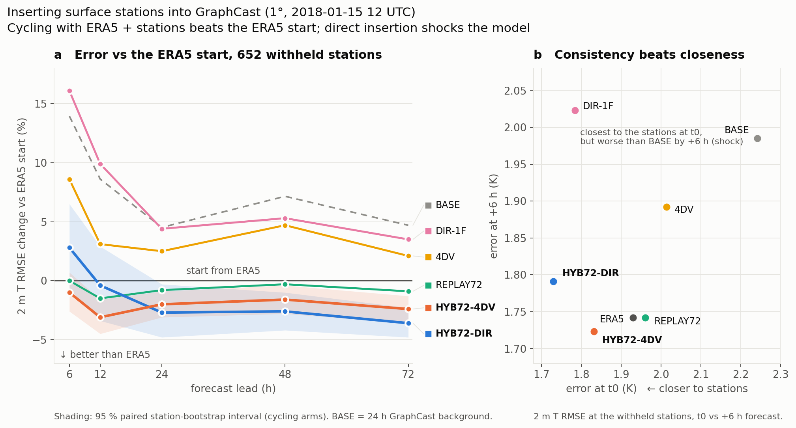

# MLanalysis: inserting observations into a frozen ML weather model

[](https://www.python.org/downloads/)
[](https://github.com/google-deepmind/graphcast)
[](SETUP_NCCS_PRISM.md)

**Question.** An ERA5-trained ML model (GraphCast) is normally started from a reanalysis. If you have observations the analysis does not contain, how should you put them into the initial state, without retraining the model, so that the forecast actually improves? Why does simple direct insertion fail? Can operational NWP techniques (IAU/replay, nudging, 4D-Var) and ML-specific methods do better?

**Setup (one case so far: 2018-01-15 12 UTC, CONUS).** Frozen GraphCast_small (1°, 13 levels; the 0.25° model was used for a resolution check). The background is a 24 h GraphCast forecast (2 m T error 1.30 K). Observations are ISD-Lite surface stations (2 m T): QC follows ECMWF-style rules, and stations are merged into 1° super-obs. 1523 stations are inserted and 652 withheld. **Truth** is the withheld ISD stations plus 120 USCRN reference stations, which are never inserted. ERA5 is the benchmark ("start from ERA5"). Significance comes from paired station bootstrap tests.




---

## Main results (1°, withheld stations unless noted)

2 m T RMSE change, in %. Negative = better; * = significant at 95 %.

| Arm | What it does | vs BASE, +6 h | vs ERA5, +12 h | vs ERA5, +24 h | vs ERA5, +72 h | USCRN vs ERA5, +72 h |
|---|---|:---:|:---:|:---:|:---:|:---:|
| DIR-1F | station analysis (OI) inserted into the t0 frame only | +1.9 | +9.9* | +4.4* | +3.5 | −1.2 |
| 4DV | two-frame 4D-Var through GraphCast (TL/adjoint via JAX) | −4.7* | +3.1 | +2.5 | +2.1 | +0.4 |
| REPLAY72 | 72 h of 6-hourly cycling, full state relaxed to ERA5 (τ = 6 h) | −12.2* | −1.5* | −0.8* | −0.9 | −2.0* |
| **HYB72-DIR** | REPLAY72 + station increments every cycle | −9.8* | −0.4 | **−2.7*** | **−3.6*** | **−4.3*** |
| **HYB72-4DV** | REPLAY72 cycle, final insertion by 4D-Var | **−13.2*** | **−3.1*** | −2.0* | −2.4* | −3.1* |

At 0.25°, HYB72-DIR is −2.5 %* (withheld) and −4.1 %* (USCRN) vs ERA5 at +72 h, with 2–5 % lower absolute errors and the same ranking of arms.

### What we learned

1. **Direct insertion shocks the model.** DIR-1F fits the stations best at t0, but by +6 h it is worse than doing nothing. Only the t0 frame changes, so GraphCast reads the mismatch between its two input frames as a tendency. At 0.25° the damage is larger (+13.6 %* vs ERA5 at +72 h).
2. **Consistency beats closeness.** 4D-Var fits the stations less closely at t0 than DIR-1F (2.01 vs 1.78 K) but forecasts better at every lead. Changing both input frames through the model's own dynamics removes the shock.
3. **The upper air must be anchored.** A 3-day free run or surface-only nudging drifts aloft (T850 error ≈ 1.9–2.0 K). Relaxing the full state to ERA5 every 6 h keeps T850 error near 0.22 K.
4. **Stations add real information on top of ERA5.** Cycling with ERA5 + stations beats starting from ERA5 by 2–4 % at 24–72 h on both independent networks. Replay alone only matches ERA5.
5. **Two regimes.** HYB72-4DV is best at 6–12 h, and HYB72-DIR is best at 24–72 h.
6. **The 4D-Var limit is the background-error model (B), not the solver or the obs error.** L-BFGS converges (gradient falls about 10⁴×). Doubling σo cuts the 4DV gain roughly in half, so the station weight is not too high.
7. **Operational extras did not beat plain HYB72-DIR in this case:** weighted 4DIAU profiles, level-selective replay, station bias correction, and the model-Jacobian vertical balance (JAC).

Details, all runs and caveats: [`RESULTS.md`](RESULTS.md) (§21–27 are the current experiments).

---

## Running

Environment and GPU setup on NCCS Prism: [`SETUP_NCCS_PRISM.md`](SETUP_NCCS_PRISM.md). Data: ERA5 (WeatherBench-2 / ARCO), ISD-Lite and USCRN (`scripts/download_*.py`).

```bash
export XLA_FLAGS=--xla_gpu_deterministic_ops=true      # bit-reproducible runs

python -u scripts/exp_main_real_obs.py --t0 2018-01-15T12:00 --obs-source isd --long-nud 72 \
    --hyb-types DIR,4DV --fdv-solver lbfgs --fdv-iter 60 \
    --arms DIR-1F,4DV,HYB72-DIR,HYB72-4DV,REPLAY72 \
    --outdir runs/exp_main/20180115T12_isd_bg_4dv 2>&1 | tee run.log
```

The script prints t0 diagnostics, RMSE tables against USCRN, withheld stations and the ERA5 grid, and bootstrap tests. It also writes nine figures. Useful options: `--arms`, `--hyb-types`, `--steps`, `--sigma-repr`, and the `--fdv-*` 4D-Var settings (`--fdv-sig`, `--fdv-L`, `--fdv-solver gn|lbfgs`). See `--help` for the full list.

## Repository

| Path | Contents |
|---|---|
| `scripts/exp_main_real_obs.py` | Main experiment: QC, OI, all insertion arms (DIR/COL/BAL/PBL, IAU, nudging, replay/hybrid cycling, JAC, 4D-Var), forecasts, verification, plots |
| `scripts/download_*.py` | ERA5 (1° and 0.25°), ISD-Lite, USCRN downloaders |
| `scripts/plot_*.py` | Synthesis figures in `docs/figs/` (`plot_readme_summary.py` makes the figure above) |
| `scripts/test_*.py`, `exp0_*` | Earlier exploratory experiments (retention, balance, IAU, twin/OSSE tests; RESULTS §1–17) |
| `RESULTS.md` | Full log of results and reviews |
| `OPERATIONAL_DA_PLAN.md` | Operational DA design, method options, roadmap (Steps 5–7) |
| `PROJECT_PLAN_LEAN.md`, `PROJECT_PLAN.md` | Project scope and original proposal |
| `DATA_SOURCES.md`, `SETUP_NCCS_PRISM.md` | Data sources; cluster setup |

## Status and next steps

- **Running now:** 4D-Var background-error tests (B × 2, correlation length 150 km).
- **Multiple dates across seasons.** Every result above is from one case, and more dates are needed before any conclusion holds.
- **B from GraphCast forecast differences (NMC method)**, then full cycled 4D-Var.
- **MERRA-2 as the anchor analysis** (anomaly initialization, replay toward MERRA-2, MERRA-2 + ERA5 blend). This includes a multivariate look at the DIR-1F / M-DIR shock: precipitation, ω, MSLP, winds. See `OPERATIONAL_DA_PLAN.md` §14.
- **Ensembles** (EDA-lite, bred vectors) scored by CRPS at withheld stations.
