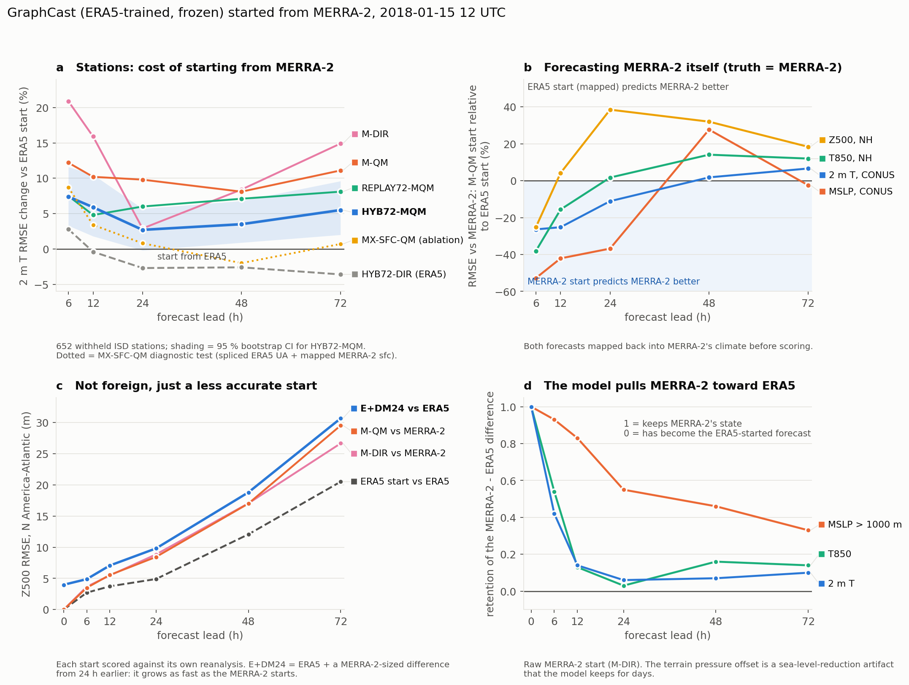
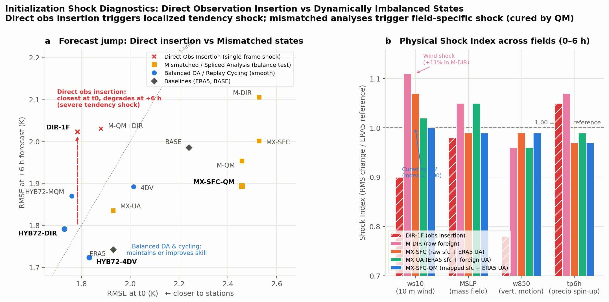

# MLanalysis: Observation Insertion and Initial-Condition Sensitivity in ML Weather Forecasting with GraphCast

[](https://www.python.org/downloads/)
[](https://github.com/google-deepmind/graphcast)
[](SETUP_NCCS_PRISM.md)

**Question & Scope.** An ERA5-trained ML model (GraphCast) is normally evaluated by starting it from the same reanalysis it was trained on. In operational NWP forecasting, however, real-time ERA5 is unavailable due to latency (~5 days). Real-world forecasting must therefore be initialized from or anchored to **foreign reanalyses (such as NASA MERRA-2, GEOS-FP, or GFS) that the model never saw during training**, alongside fresh in-situ observations.

This project investigates:
1. **Foreign-analysis forecasting:** How can a frozen ML model be initialized from a foreign reanalysis like MERRA-2 without suffering severe distribution mismatch or initialization shock?
2. **Observation insertion:** If you have observations the analysis does not contain, how should you put them into the initial state, without retraining the model, so that the forecast actually improves?
3. **Operational DA mechanisms:** Why does direct insertion fail, and can operational NWP techniques (IAU/replay, nudging, 4D-Var, anomaly initialization) bridge foreign analyses and real observations into frozen ML models?

**Setup.** Frozen GraphCast_small (1°, 13 levels; the 0.25° model was used for a resolution check). The background is a 24 h GraphCast forecast (2 m T error 1.30 K). Observations are ISD-Lite surface stations (2 m T): QC follows ECMWF-style rules, and stations are merged into 1° super-obs. 1523 stations are inserted and 652 withheld. **Truth** is the withheld ISD stations plus 120 USCRN reference stations, which are never inserted. ERA5 is the benchmark ("start from ERA5"). Significance comes from paired station bootstrap tests.


---

## Main results (1°, withheld stations unless noted)

2 m T RMSE change, in %. Negative = better; * = significant at 95 %.

| Arm | What it does | vs BASE, +6 h | vs ERA5, +12 h | vs ERA5, +24 h | vs ERA5, +72 h | USCRN vs ERA5, +72 h |
|---|---|:---:|:---:|:---:|:---:|:---:|
| DIR-1F | station analysis (OI) inserted into the t0 frame only | +1.9 | +9.9* | +4.4* | +3.5 | −1.2 |
| 4DV | two-frame 4D-Var through GraphCast (TL/adjoint via JAX) | −4.7* | +3.1 | +2.5 | +2.1 | +0.4 |
| REPLAY72 | 72 h of 6-hourly cycling, full state relaxed to ERA5 (τ = 6 h) | −12.2* | −1.5* | −0.8* | −0.9 | −2.0* |
| **HYB72-DIR** | REPLAY72 + station increments every cycle | −9.8* | −0.4 | **−2.7*** | **−3.6*** | **−4.3*** |
| **HYB72-4DV** | REPLAY72 cycle, final insertion by 4D-Var | **−13.2*** | **−3.1*** | −2.0* | −2.4* | −3.1* |

At 0.25°, HYB72-DIR is −2.5 %* (withheld) and −4.1 %* (USCRN) vs ERA5 at +72 h, with 2–5 % lower absolute errors and the same ranking of arms.

### What we learned

1. **Direct insertion shocks the model.** DIR-1F fits the stations best at t0, but by +6 h it is worse than doing nothing. Only the t0 frame changes, so GraphCast reads the mismatch between its two input frames as a tendency. At 0.25° the damage is larger (+13.6 %* vs ERA5 at +72 h).
2. **Consistency beats closeness.** 4D-Var fits the stations less closely at t0 than DIR-1F (2.01 vs 1.78 K) but forecasts better at every lead. Changing both input frames through the model's own dynamics removes the shock.
3. **The upper air must be anchored.** A 3-day free run or surface-only nudging drifts aloft (T850 error ≈ 1.9–2.0 K). Relaxing the full state to ERA5 every 6 h keeps T850 error near 0.22 K.
4. **Stations add real information on top of ERA5.** Cycling with ERA5 + stations beats starting from ERA5 by 2–4 % at 24–72 h on both independent networks. Replay alone only matches ERA5.
5. **Two regimes.** HYB72-4DV is best at 6–12 h, and HYB72-DIR is best at 24–72 h.
6. **The 4D-Var limit is the background-error model (B), not the solver or the obs error.** L-BFGS converges (gradient falls about 10⁴×). Doubling σo cuts the 4DV gain roughly in half, so the station weight is not too high.
7. **Operational extras did not beat plain HYB72-DIR:** weighted 4DIAU profiles, level-selective replay, station bias correction, and the model-Jacobian vertical balance (JAC).

Details, all runs and caveats: [`RESULTS.md`](RESULTS.md) (§0 summary; §21–27 station insertion).

---

## Starting GraphCast from a foreign reanalysis (MERRA-2)

GraphCast was trained only on ERA5, but a real-time system has to start from another centre's analysis. We start the frozen model from NASA MERRA-2 and score it three ways: against stations, against ERA5, and against MERRA-2's own analyses. `scripts/prep_merra2.py` converts MERRA-2 to GraphCast inputs. `scripts/build_clim.py` builds the January climatologies. `scripts/score_anomalies.py` does the MERRA-2 verification.



| Arm | Initial state | Withheld stations vs ERA5 start, +6 h / +72 h | USCRN vs ERA5 start, +72 h |
|---|---|:---:|:---:|
| M-DIR | raw MERRA-2 | +20.9* / +14.9* | +8.0* |
| M-QM | MERRA-2 mapped to ERA5's climate (hour-of-day mean + variance) | +12.2* / +11.1* | +6.1* |
| REPLAY72-MQM | 72 h cycling relaxed toward M-QM | +7.5* / +8.1* | +3.7 |
| **HYB72-MQM** | REPLAY72-MQM + station increments every cycle | +7.4* / +5.5* | **+2.0** |

### What we learned
1. **A raw MERRA-2 start costs 15–21 %, and it is not an initialization shock.** The first-step change matches ERA5's. MERRA-2's sea-level pressure over high terrain is offset by about −5 hPa (a reduction artifact), and the model keeps it for days.
2. **Diagnostic balance test: unbalanced mixed states do not cause shock** (§33). To test whether dynamically inconsistent initial states shock GraphCast, we created hybrid ablation arms (MX-SFC, MX-UA, MX-SFC-QM) mixing ERA5 and MERRA-2. The model smoothly integrates spliced states without dynamic blowup; the error tracks the quality of whichever analysis provided the upper air.
3. **The penalty has two separable components.** The *surface* component (terrain MSLP artifact, 10 m wind shock) is climate mismatch that QM mapping eliminates completely (MX-SFC-QM shock index $\approx 1.00$). The *upper-air* component (w850 shock at 6–12 h, Z500 error growth) is analysis quality and cannot be mapped away. *(Note: MX arms are diagnostic probes, not operational methods, since real-time ERA5 upper air is unavailable).*
4. **Map, cycle, add stations.** Anomaly initialization + replay + own stations (HYB72-MQM) halves the operational penalty and ties the ERA5 start at USCRN. It still trails the ERA5-based HYB72-DIR.
5. **To forecast MERRA-2 itself, map in and out** (panel b). The mapped MERRA-2 start predicts MERRA-2 better for ~24 h near the surface and 6–12 h aloft. After that, an ERA5 start converted to MERRA-2's climate does better.
6. **MERRA-2 is a less accurate start, not a foreign one** (panel c). ERA5 plus a MERRA-2-sized difference (E+DM24) degrades as much as a MERRA-2 start. So fine-tuning GraphCast on MERRA-2 would not remove the main penalty; better or averaged initial conditions would.

Caveat: withheld ISD stations lean toward ERA5, whose land-surface analysis uses them; MERRA-2 does not assimilate land-station 2 m T. USCRN is the fairer network. Details: [`RESULTS.md`](RESULTS.md) §28–33.

---

## Initialization shock: direct observation insertion vs. dynamically mismatched states

Why do direct observation insertion and foreign reanalyses degrade forecasts, and what kind of shock do they produce? We compared single-frame observation insertion (`DIR-1F`, `M-QM+DIR`), balanced DA (`4DV`, `HYB72-*`), and diagnostic mixed-state ablations (`MX-SFC`, `MX-UA`, `MX-SFC-QM`).



1. **Direct observation insertion causes acute tendency shock (panel a):** Inserting observations into the $t_0$ frame only fits stations closest at $t_0$ ($1.78\text{ K}$), but degrades sharply by $+6\text{ h}$ ($2.02\text{ K}$, a $+16\%$ penalty vs ERA5). The two-frame input sees an unphysical tendency. Balanced methods (4D-Var or replay cycling) adjust across time, avoiding the jump entirely.
2. **Dynamically mismatched states do not cause catastrophic shock (panel a):** Splicing surface and upper-air fields across reanalyses does not trigger dynamic blowup; the points follow standard forecast relaxation.
3. **Physical shock is field-specific and cured by QM (panel b):** Raw foreign surface fields trigger surface wind shock ($10\text{ m}$ wind index $1.07\text{–}1.11$) and terrain MSLP offset ($-5.9\text{ hPa}$). Quantile mapping (QM) eliminates this completely (shock index $\approx 1.00$). Splicing upper air causes mass/vertical velocity shock aloft. Thus, surface shock is a distribution mismatch, not a dynamic barrier.

---

## Running

Environment and GPU setup on NCCS Prism: [`SETUP_NCCS_PRISM.md`](SETUP_NCCS_PRISM.md). Data: ERA5 (WeatherBench-2 / ARCO), ISD-Lite and USCRN (`scripts/download_*.py`).

```bash
export XLA_FLAGS=--xla_gpu_deterministic_ops=true      # bit-reproducible runs

python -u scripts/exp_main_real_obs.py --t0 2018-01-15T12:00 --obs-source isd --long-nud 72 \
    --hyb-types DIR,4DV --fdv-solver lbfgs --fdv-iter 60 \
    --arms DIR-1F,4DV,HYB72-DIR,HYB72-4DV,REPLAY72 \
    --outdir runs/exp_main/20180115T12_isd_bg_4dv 2>&1 | tee run.log
```

The script prints t0 diagnostics, RMSE tables against USCRN, withheld stations and the ERA5 grid, and bootstrap tests. It also writes figures. Useful options: `--arms`, `--hyb-types`, `--steps`, `--sigma-repr`, and the `--fdv-*` 4D-Var settings (`--fdv-sig`, `--fdv-L`, `--fdv-solver gn|lbfgs`). See `--help` for the full list.

## Repository

| Path | Contents |
|---|---|
| `scripts/exp_main_real_obs.py` | Main experiment: QC, OI, all insertion arms (DIR/COL/BAL/PBL, IAU, nudging, replay/hybrid cycling, JAC, 4D-Var), forecasts, verification, plots |
| `scripts/download_*` | ERA5 (1° and 0.25°), ISD-Lite, USCRN, MERRA-2 (`download_merra2.sh`) downloaders |
| `scripts/prep_merra2.py`, `build_clim.py`, `score_anomalies.py`, `plot_global_maps.py` | MERRA-2 → GraphCast inputs, hour-of-day climatologies, verification against MERRA-2, global maps |
| `scripts/plot_*.py` | Synthesis figures in `docs/figs/` (`plot_readme_summary.py`, `plot_readme_merra2.py`, `plot_shock_comparison.py`) |
| `scripts/test_*.py`, `exp0_*` | Earlier exploratory experiments (retention, balance, IAU, twin/OSSE tests; RESULTS §1–17) |
| `RESULTS.md` | Full log of results and reviews |
| `OPERATIONAL_DA_PLAN.md` | Operational DA design, method options, roadmap (Steps 5–7) |
| `PROJECT_PLAN_LEAN.md`, `PROJECT_PLAN.md` | Project scope and original proposal |
| `DATA_SOURCES.md`, `SETUP_NCCS_PRISM.md` | Data sources; cluster setup |

## Next steps

- **Multiple dates across seasons:** Evaluating across diverse seasonal regimes (summer convective vs. winter baroclinic) with month-specific climatologies.
- **Ensembles:** EDA-lite and bred vectors evaluated with CRPS at independent withheld stations.
- **Output calibration:** Lead-dependent systematic error correction from past GraphCast forecasts.
- **Flow-dependent B in 4D-Var:** NMC-based background error covariance to replace isotropic diffusion.
